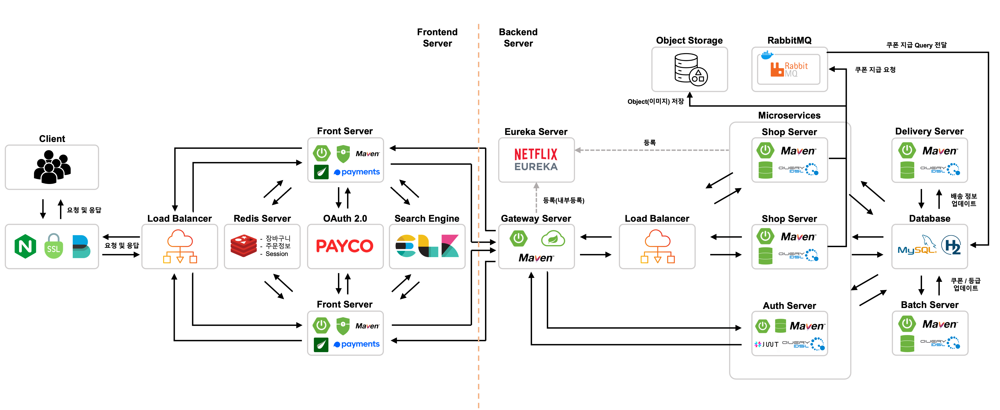

# No24 Bookstore

## 실행

### Package
`mvn package -f pom.xml`

### Execute
`java -Dserver.port=${port} -jar -Dspring.profiles.active=${active_file} -Deureka.instance.instance-id=${instance_id} ~/target/shop.jar > log  2>&1 &`

## Service Introduction
클라우드 서비스를 적용한 Spring boot 웹 도서 쇼핑몰 서비스

## System Architecture

> 1. 클라이언트의 요청은 NginX를 통해서 들어오고, 로드밸런서에서 Round Robin 방식으로 2개의 Front Server에 순서대로 보낸다.
> 2. Front Server
>   -	Front Server는 SSL을 적용하여 https 환경으로 구성하였으며, NginX 로그를 Filebeat가 수집하여 Logstash에 전송한다.
>   -	Client의 session id를 key로 사용하여 redis server를 session으로 사용한다. 이는 장바구니, 임시 주문정보, JWT token 저장에 사용된다.
>   -	Client의 검색 요청은 Search Engine (이하 ELK)으로 전달되어 요청에 대한 값으로 응답을 처리한다.
>   -	필요한 요청을 API Gateway를 통해 처리하고, Gateway는 해당 요청에 대해 처리되어야 하는 서비스 API로 요청을 보낸다.
> 3. Services
>   -	Gateway, shop, Auth server는 모두 eureka server에 등록되어, Gateway에 도착한 요청을 적절히 라우팅 처리한다.
>   -	Shop Server는 두 개의 서버 (포트)로 구성되어 있으며, 이에 대한 요청은 Gateway에서 Round Robin 방식으로 로드밸런싱하여 요청한다.
>   -	Shop, Auth, Delivery, Batch, RabbitMQ는 MySQL (Test의 경우, H2 Database)과 통신하여 데이터 수집 및 저장, 변경, 삭제한다.
>   -	Shop Server에서 '쿠폰 지급' 기능에서는 요청 과부하를 Queue를 활용하여 막기 위해 Docker 환경 위의 RabbitMQ 서버에 전달하여 요청한다.
>   -	Auth Server에서는 JWT를 활용하여 인증 요청이 오는 경우, 토큰 인증, 토큰 재발급을 시행한다.
>   -	Shop Server에서 리뷰, 도서 저장 등 이미지 저장 요청이 오는 경우 NHN Cloud Object Storage에 저장한다.

## CI/CD

> Github을 통해 코드베이스를 관리하며 기본적으로 Github Action과 Jenkins를 통한 CI를 진행하여 빌드하고 테스트가 진행되어 성공 시 통합과정이 이뤄진다. 
> - Shop Server와 Front Server는 Github Action을 통해 배포하며, 그 외 서버는 모두 Jenkins를 통해 배포한다.
> - Test 분석 로그 및 빌드 로그가 많은 경우, Jenkins를 통해 배포할 때 Cloud instance의 메모리 및 CPU 할당량을 초과하는 경우가 발생하여 Github action으로 배포 환경을 변경하였음.
> - 통합과정 이후, sonarQube를 통해 정적 코드 분석을 진행하며, 이에 대한 Bug, Test Coverage, Branch Coverage를 저장한다.
> - 통합과정 이후, 이상이 없는 경우 NHN Cloud의 instance에 각각 배포한다.

## Project Management

### WBS
- 구글 Sheet 및 github roadmap 활용하여 간트차트를 만들고, 해당 일자의 마일스톤을 정리 및 수행함.

### Kanban Board
- GitHub project 칸반보드 활용

### Test Coverage (Target: Line coverage 80%)
- Line coverage: 84.8% (2024\. 05\. 12\. 기준)

## 주요 기능

### 인프라
- 담당자: 박병휘, 진지원
- Redis Session
  - Front server에서 사용하는 Redis 환경과 동일하게 설정
- Database
  - 배포(MySQL)와 테스트(H2) database 환경을 분리

### 주소
- 담당자: 진지원
- 회원 - 주소 조회, 등록, 수정, 삭제 기능 구현
  - 수정 시, 회원 주소가 10개 이상인 경우, 추가 못하도록 설정
- 기본 주소 설정 기능 구현

### 저자
- 담당자: 박동희
- 도서 - 저자 조회, 등록, 수정, 삭제 기능 구현

### 도서
- 담당자: 이재원, 강병구, 박동희
- 도서 조회, 등록, 수정, 삭제 기능 구현
  - 전체 조회, ISBN 조회, 카테고리 조회, 책상태 변경, 책 세부내용 수정 기능

### 카테고리
- 담당자: 강병구
- 카테고리 조회, 수정, 등록, 삭제 기능 구현
  - 카테고리 전체 조회, 상위 카테고리 조회, 하위 카테고리 조회 기능 구현

### 장바구니
- 담당자: 진지원
- 장바구니 조회, 수정, 등록, 삭제 기능 구현
  - Redis Session을 활용하여 회원 / 비회원 장바구니 조회 기능 구현

### 쿠폰
- 담당자: 강병구, 박병휘
- 쿠폰 조회, 수정, 등록, 삭제 기능 구현
  - 쿠폰의 할인 방식(일정 금액, 할인율)과 할인 타켓(일반, 도서 대상, 카테고리 대상)을 구분지어 저장
  - CouponResponseDto, CouponRequestDto로 통합

### 회원
- 담당자: 김병주, 박병휘
- 회원 조회
  - Customer(전체 고객, 비회원 포함)과 Member의 연관관계를 설정하여 비회원과 회원을 구분
- 등급 조회, 등록, 수정, 삭제 기능 구현 

### 주문
- 담당자: 박동희, 박병휘
- 결제
  1. 결제 수단 확인
  2. 회원 여부 확인
  3. 주문 상세 저장
     - 책 수량 확인
     - 포장지 정보 확인
     - 책 수량 업데이트
     - 쿠폰 사용 정보 업데이트
  4. 포인트 이력 추가
  5. 회원 등급 확인
- 포장 조회, 등록, 수정, 삭제 기능 구현
- 결제수단 조회, 등록, 수정, 삭제 기능 구현

### 포인트
- 담당자: 강병구, 박병휘
- 포인트 적립, 내역 조회 기능 구현

### 리뷰
- 담당자: 강병구
- 리뷰 조회, 등록, 수정, 삭제 기능 구현

### 태그
- 담당자: 박병휘
- 태그 조회, 등록, 수정, 삭제 기능 구현

## Stack

       
     

  
     
 

## 팀원

